# Oasis — Policyholder App

A mobile app that lets an insurance policyholder manage their policies and claims from their phone — view active coverage, submit a new claim through a guided wizard, track claim status, and reach their broker for support.

> **Status: UI-only prototype.** Every screen is built and fully navigable with local mock data. There is no backend yet, no authentication, and no state management wired up — see [Known Limitations / TODO](#known-limitations--todo).

---

## Table of Contents

- [Screens](#screens)
- [Tech Stack](#tech-stack)
- [Architecture Overview](#architecture-overview)
- [Features](#features)
- [Getting Started](#getting-started)
  - [Prerequisites](#prerequisites)
  - [Environment Setup](#environment-setup)
  - [Installation](#installation)
  - [Run](#run)
  - [Build](#build)
- [Project Structure](#project-structure)
- [API Overview](#api-overview)
- [State Management Pattern](#state-management-pattern)
- [Dependency Injection](#dependency-injection)
- [Environment Variables Reference](#environment-variables-reference)
- [Testing](#testing)
- [CI/CD](#cicd)
- [Contributing](#contributing)
- [Known Limitations / TODO](#known-limitations--todo)
- [License](#license)

---

## Screens

Captured directly from the design source of truth — `doc/design/Oasis policyholder mobile app/Oasis Policyholder App.dc.html` — the same interactive prototype the UI-only build in `lib/features/` was implemented pixel-for-pixel against. Full-size images live in [`doc/design/screenshots/`](doc/design/screenshots/).

<table>
<tr>
<td align="center" width="25%">
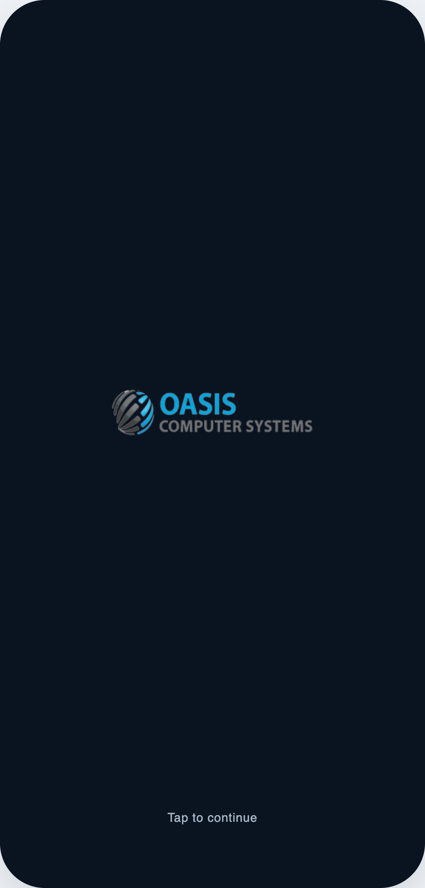<br>
<sub><b>Splash</b></sub>
</td>
<td align="center" width="25%">
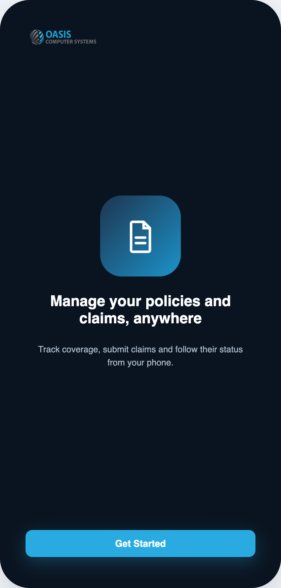<br>
<sub><b>Onboarding</b></sub>
</td>
<td align="center" width="25%">
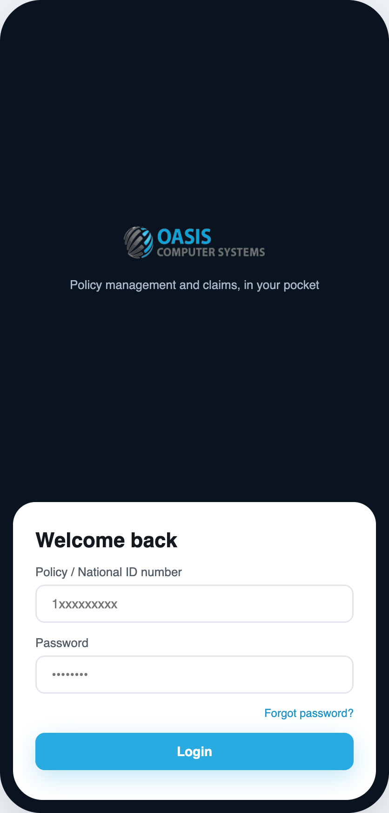<br>
<sub><b>Login</b></sub>
</td>
<td align="center" width="25%">
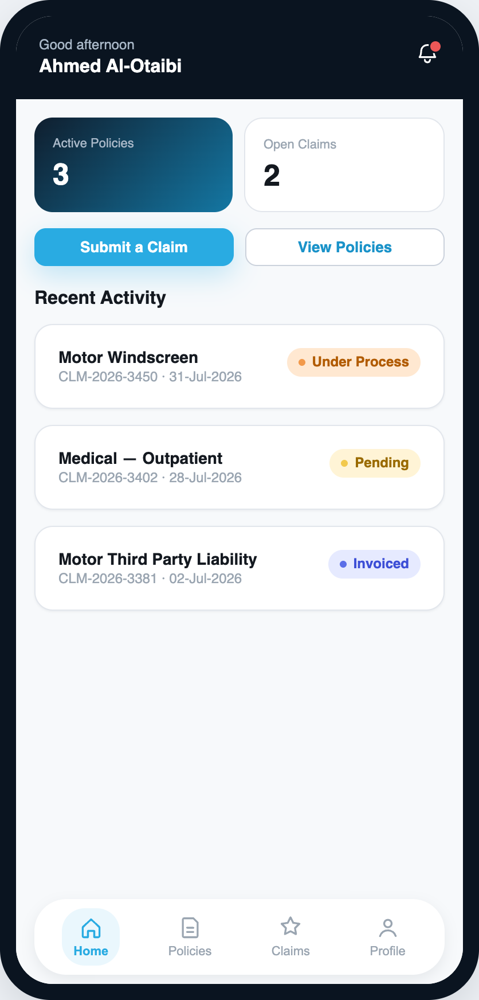<br>
<sub><b>Home</b></sub>
</td>
</tr>
<tr>
<td align="center" width="25%">
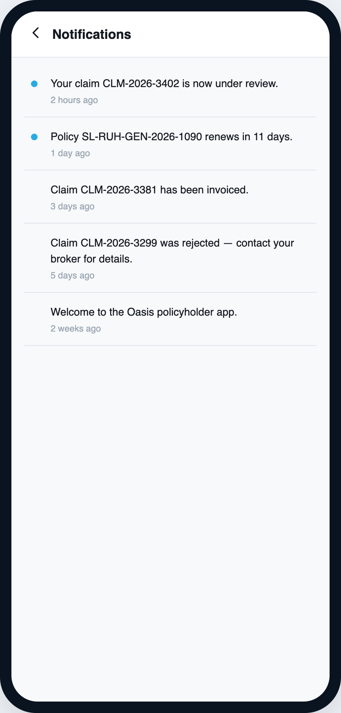<br>
<sub><b>Notifications</b></sub>
</td>
<td align="center" width="25%">
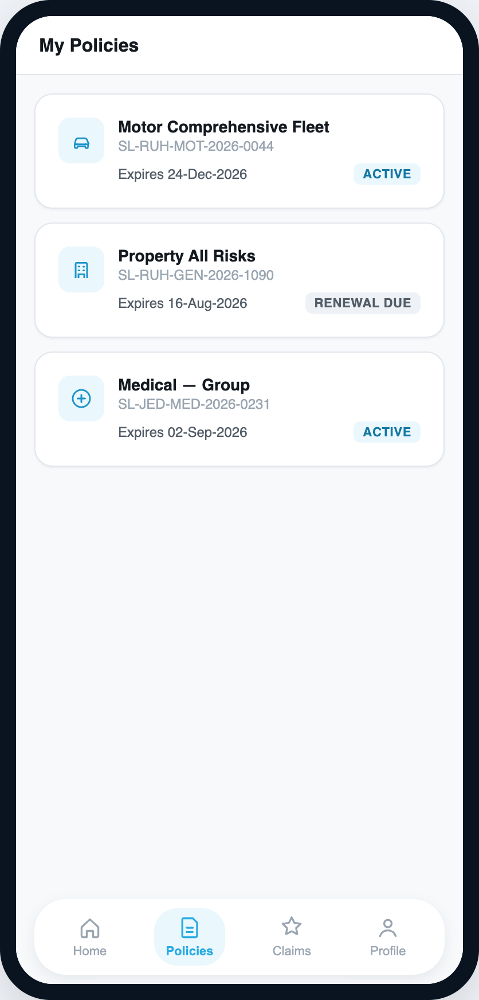<br>
<sub><b>Policies</b></sub>
</td>
<td align="center" width="25%">
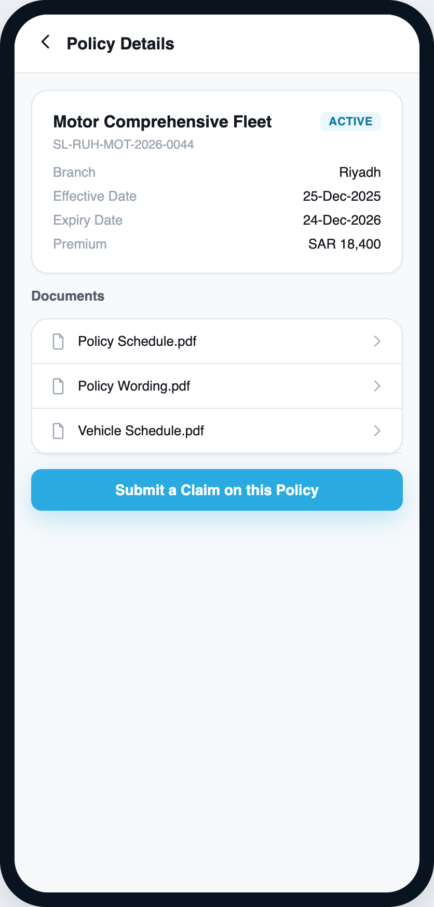<br>
<sub><b>Policy Detail</b></sub>
</td>
<td align="center" width="25%">
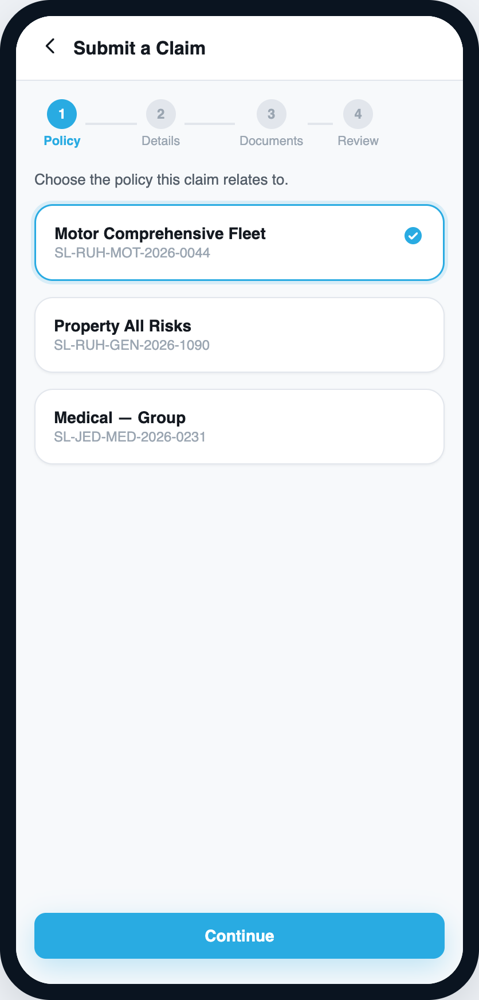<br>
<sub><b>Submit Claim</b></sub>
</td>
</tr>
<tr>
<td align="center" width="25%">
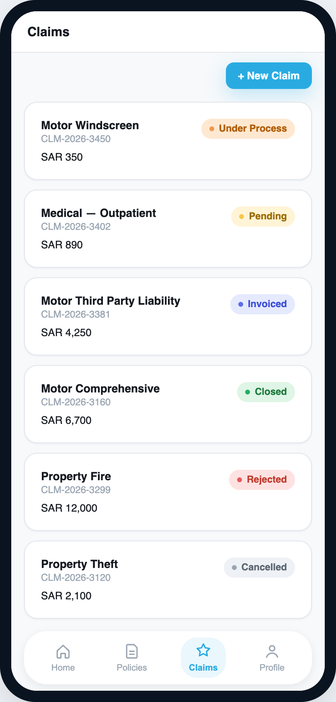<br>
<sub><b>Claims</b></sub>
</td>
<td align="center" width="25%">
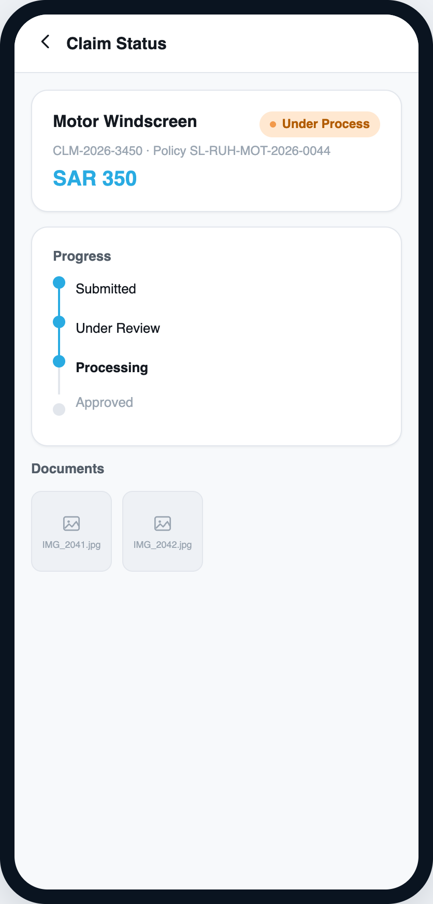<br>
<sub><b>Claim Detail</b></sub>
</td>
<td align="center" width="25%">
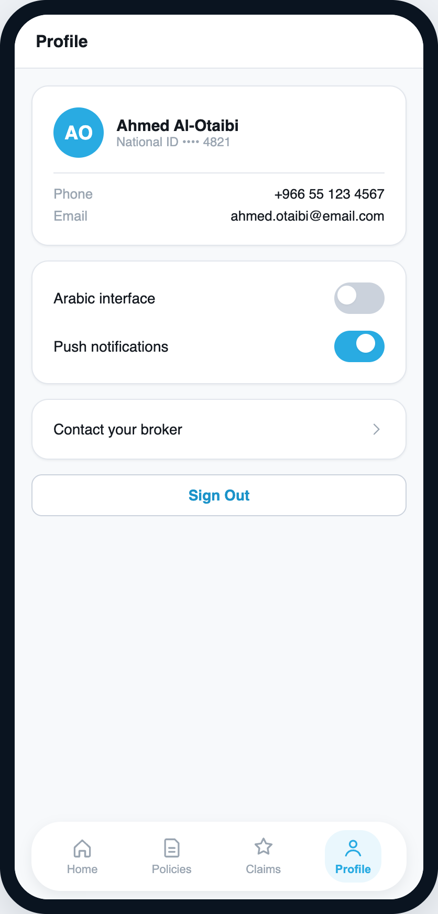<br>
<sub><b>Profile</b></sub>
</td>
<td align="center" width="25%">
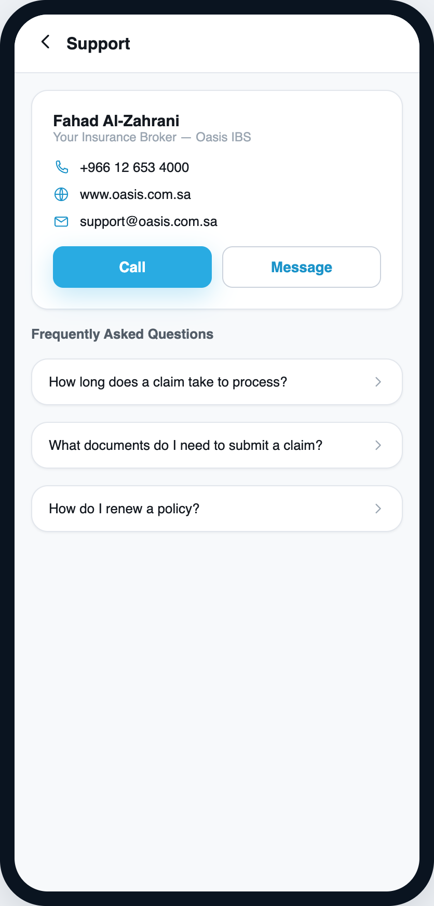<br>
<sub><b>Support</b></sub>
</td>
</tr>
</table>

> These are the **design mock**, not live app screenshots — the actual Flutter build ([`lib/features/`](lib/features/)) reproduces this UI pixel-for-pixel per the build handoff notes (`doc/handoffs/002-policyholder-app-ui/`), but has not yet been screenshotted running on a simulator/device (see [Known Limitations / TODO](#known-limitations--todo)).

---

## Tech Stack

**Framework**
- [Flutter](https://flutter.dev) `^3.12.2` (Dart SDK constraint from `pubspec.yaml`) — pinned to **Flutter 3.44.8** via [fvm](https://fvm.app) (`.fvm/fvm_config.json`)

**Networking**
- `dio ^5.11.0` — HTTP client
- `pretty_dio_logger ^1.4.0` — request/response logging (debug builds only)
- `connectivity_plus ^7.3.1` — connectivity detection

**State management**
- `flutter_bloc ^9.1.1` — Cubit-first (per project convention); no cubits exist yet in this UI-only pass

**Dependency injection**
- `get_it ^9.2.1` + `injectable ^3.0.0` (codegen via `injectable_generator ^3.1.1` + `build_runner ^2.15.1`)

**Functional error handling**
- `dartz ^0.10.1` — `Either<Failure, T>` result type

**Storage**
- `flutter_secure_storage ^10.3.1` — tokens (not yet in use — no auth backend)
- `shared_preferences ^2.5.5` — key-value cache

**Routing**
- `go_router ^17.4.0` — declarative navigation, `StatefulShellRoute` bottom-nav shell

**UI utilities**
- `flutter_screenutil ^5.9.3` — proportional scaling (390×844 design canvas)
- `flutter_svg ^2.3.0`, `cached_network_image ^3.4.1`, `shimmer ^3.0.0`
- `google_fonts ^8.2.1` — Poppins (display/headline) + Inter (title/body/label)
- `equatable ^2.1.0`

**Localization**
- `easy_localization ^3.0.8` + `intl ^0.20.2` — English and Arabic, RTL-aware

**Other**
- `url_launcher ^6.3.2`, `cupertino_icons ^1.0.8`, `flutter_launcher_icons ^0.14.4`

**Dev / tooling**
- `flutter_lints ^6.0.0`, `flutter_test` (SDK)

---

## Architecture Overview

The project follows **Clean Architecture with a feature-first folder structure**:

```
Presentation → Domain → Data
Feature      → Core
```

All shared infrastructure (networking, DI, routing, theming, storage, design-system widgets) lives in `lib/core/`. Each product feature lives in its own folder under `lib/features/<feature_name>/`, split into `data/`, `domain/`, and `presentation/` layers. Features never import from one another — cross-feature navigation goes through typed argument classes in `lib/core/router/args/`.

At present, only the **presentation** layer exists for every feature — this is a UI-only build. Each screen uses local hardcoded mock data (`*_mock_data.dart` files) and `StatefulWidget`/`setState` for ephemeral UI state (wizard steps, FAQ accordion, splash timer). No `data/` or `domain/` folders exist yet; they will appear feature-by-feature as real cubits/repositories are wired in, following `.claude/rules/flutter_feature_prompt.md`.

```
lib/
├── core/                     # Shared infrastructure — imported by every feature
│   ├── constants/            # Design tokens, API config, spacing scale
│   ├── di/                   # get_it + injectable wiring
│   ├── helpers/               # DialogHelper, BottomSheetHelper, date/regex helpers
│   ├── network/               # ApiManager, Failure hierarchy, AuthInterceptor, DioFactory
│   ├── router/                # GoRouter setup, route names, typed nav args
│   ├── storage/               # SecureStorageHelper (FlutterSecureStorage wrapper)
│   ├── theme/                 # AppColors, AppTextStyles, AppTheme
│   └── widgets/               # Shared design-system widgets (Ds*) + loading/empty/error states
└── features/
    ├── auth/                 # Splash, onboarding, login
    ├── home/                 # Dashboard: stats, quick actions, recent activity
    ├── policies/              # Policy list + detail
    ├── claims/                # Claims list, detail, 4-step submit-claim wizard
    ├── notifications/          # Notifications inbox
    ├── profile/                # Settings, language switch, sign out
    └── support/                # Broker contact + FAQ accordion
```

---

## Features

Derived from the actual routes registered in `lib/core/router/app_router.dart` and the screens under `lib/features/`:

- **Splash & Onboarding** — auto-advancing splash screen, single onboarding slide with "Get Started"
- **Login** — policy/national ID + password form, forgot-password flow (UI only, no real auth call yet)
- **Home dashboard** — greeting header, active policy / open claim stats, quick actions, recent activity feed
- **Policies** — policy list and a detail screen per policy, with a "Submit a Claim on this Policy" shortcut
- **Claims** — claims list with status badges, claim detail with a 4-step status timeline
- **Submit Claim wizard** — 4-step guided flow: policy selection → claim details → document upload → review & confirm (via a bottom sheet)
- **Notifications** — notifications inbox
- **Profile** — account settings, Arabic/English language switch (fully wired via `easy_localization`), sign out
- **Support** — broker contact (call/message via `url_launcher`), FAQ accordion

**Bottom navigation** — a persistent 4-tab shell (Home / Policies / Claims / Profile) built with `StatefulShellRoute.indexedStack`, so each tab keeps its own scroll position and local state when switching.

**Localization** — every user-facing string in both `en.json` and `ar.json`; switching to Arabic flips the app to RTL live.

---

## Getting Started

### Prerequisites

| Tool | Version | Notes |
|---|---|---|
| Flutter SDK | `3.44.8` (pinned via [fvm](https://fvm.app), see `.fvm/fvm_config.json`) | Always invoke as `fvm flutter ...` / `fvm dart ...` — the bare `flutter`/`dart` on `PATH` may resolve to a different SDK version and fail `pub get` against this project's `^3.12.2` Dart constraint |
| Dart SDK | `^3.12.2` | Comes bundled with the pinned Flutter version |
| Xcode | Latest stable | Required for iOS builds/simulator (`IPHONEOS_DEPLOYMENT_TARGET = 13.0`) |
| Android Studio / SDK | Latest stable | Required for Android builds/emulator |

Install fvm and the pinned Flutter version if not already set up:
```bash
dart pub global activate fvm
fvm install
fvm use
```

### Environment Setup

No `.env` files and no third-party env package are used. Environment switching is done entirely via a single Dart compile-time define, resolved in `lib/core/constants/api_constants.dart`:

```dart
const String _environment = String.fromEnvironment('ENVIRONMENT', defaultValue: 'dev');
```

| Key | Purpose | Required? |
|---|---|---|
| `ENVIRONMENT` | Selects `dev` or `prod` API base URL at compile time | No — defaults to `dev` |

No secrets or `.env` files exist in this repo. See [Environment Variables Reference](#environment-variables-reference) for the full list including secure-storage keys.

**VS Code (`launch.json`)** — add to `args`:
```json
"args": ["--dart-define=ENVIRONMENT=prod"]
```

**Android Studio** — Run/Debug Configuration → "Additional run args": `--dart-define=ENVIRONMENT=prod`

### Installation

```bash
fvm flutter pub get
```

### Run

```bash
# Dev environment (default) — pick an iOS simulator or Android emulator, not desktop
fvm flutter run

# Prod environment
fvm flutter run --dart-define=ENVIRONMENT=prod

# Target a specific device
fvm flutter devices
fvm flutter run -d <device-id>
```

> This is a phone-form-factor app (Material Design everywhere, no platform-adaptive UI) — always run on an iOS simulator or Android emulator/device, not desktop.

After adding or changing any `@injectable`/`@lazySingleton`/`@module` class, regenerate the DI config:
```bash
fvm dart run build_runner build --delete-conflicting-outputs

# Watch mode during active development
fvm dart run build_runner watch --delete-conflicting-outputs
```

Static analysis:
```bash
fvm flutter analyze
```

### Build

```bash
# Android APK (prod)
fvm flutter build apk --dart-define=ENVIRONMENT=prod

# iOS (prod)
fvm flutter build ios --dart-define=ENVIRONMENT=prod
```

`flutter_launcher_icons` is configured in `pubspec.yaml` (`assets/icon/icon.png` + adaptive foreground) but icon generation must be run explicitly:
```bash
fvm dart run flutter_launcher_icons
```

---

## Project Structure

```
oasis_demo/
├── android/                  # Android platform project (min/target/compile SDK from Flutter defaults)
├── ios/                      # iOS platform project (deployment target 13.0)
├── assets/
│   ├── translations/         # en.json, ar.json — easy_localization source strings
│   ├── images/                # Brand logo assets (logo_full.png, logo_mark.jpeg)
│   └── icon/                  # flutter_launcher_icons source images
├── doc/
│   ├── design/                 # Oasis Design System tokens/components + full interactive HTML prototype
│   └── handoffs/                # Session handoff notes (foundation scaffold, UI build)
├── lib/
│   ├── core/                  # Shared infrastructure — see Architecture Overview
│   ├── features/               # 7 feature folders — see Architecture Overview
│   └── main.dart               # App entry point: binding → EasyLocalization → intl → DI → runApp
├── test/
│   └── widget_test.dart        # ⚠️ stock counter smoke test — see Testing
├── .claude/rules/               # Architecture rule files consumed by Claude Code (scaffold + feature guides)
├── pubspec.yaml
└── analysis_options.yaml        # flutter_lints
```

---

## API Overview

> ⚠️ **No backend exists yet.** `ApiConstants.baseUrl` points at placeholder URLs (`https://api-dev.placeholder.com/v1` / `https://api.placeholder.com/v1`) that are not live. All screens currently use local hardcoded mock data instead of network calls.

The networking layer is fully scaffolded and ready for a real backend:

- **Base URL** — env-aware, see [Environment Setup](#environment-setup)
- **Auth mechanism** — Bearer token via `AuthInterceptor` (`lib/core/network/interceptors/auth_interceptor.dart`), with silent token refresh on 401 (shared in-flight refresh via `Completer`, no request storm, no recursion). Not yet exercised — no login endpoint is wired up.
- **Error handling** — every `DioException` is mapped by `ApiManager` (`lib/core/network/api_manager.dart`) to a `Failure` subtype and returned as `Either<Failure, T>` (dartz). Never throws.
- **Known endpoint paths** (`lib/core/constants/api_constants.dart`) — `/auth/login`, `/auth/refresh-token`, `/auth/logout`. No feature endpoints exist yet; each future feature will add its own path constants and data source.
- **Response envelope** — not yet confirmed with a real backend. `lib/core/network/api_manager.dart` carries a marker comment for adding `api_envelope.dart` once the shape is known.

---

## State Management Pattern

The project convention is **Cubit-first** (`flutter_bloc`), with Bloc reserved only for complex event-driven flows a Cubit can't express cleanly. Convention (not yet exercised by real code):

- One cubit per concern — an **action** cubit (mutations) split from a **list/query** cubit (reads) when a feature has both, to avoid state collisions (`BlocConsumer` for actions, `BlocBuilder` for lists).
- Every cubit state is a `sealed class` extending `Equatable`, with `final class` variants (`Initial` / `Loading` / `Success` / `Error`).
- Cubits are registered `@injectable` (factory scope) and provided via `BlocProvider` inside `AppRouter`'s route builders — never inside a screen widget.

**No cubit exists in the codebase yet** — every screen currently manages its own ephemeral UI state with plain `StatefulWidget`/`setState` (e.g. `lib/features/claims/presentation/pages/submit_claim_screen/submit_claim_screen.dart` for the wizard's step state). See the full convention and template in `.claude/rules/flutter_feature_prompt.md` §2/§4/§5.

---

## Dependency Injection

Wired with `get_it` + `injectable`:

- **Entry point** — `lib/core/di/injection_container.dart`, annotated `@InjectableInit()`, exposes `getIt` and `configureDependencies()`.
- **Manual providers** — `lib/core/di/register_module.dart` (a `@module` abstract class) provides every third-party type that has no annotation of its own: `FlutterSecureStorage`, `Connectivity`, `GlobalKey<NavigatorState>` (`@singleton`), `GoRouter` (`@singleton`, built from the navigator key), `Dio` (`@singleton`, built by `DioFactory`), `SharedPreferences` (`@preResolve @singleton`).
- **Generated config** — `lib/core/di/injection_container.config.dart`. Regenerate after any `@injectable`/`@lazySingleton`/`@module` change:
  ```bash
  fvm dart run build_runner build --delete-conflicting-outputs
  ```
- **Currently registered services**: `SecureStorageHelper`, `ConnectivityHelper`, `DioFactory`, `ApiManager`, `DialogHelper` (all `@lazySingleton`), plus the `RegisterModule` providers above. No feature-level cubits/repositories are registered yet.
- **To register a new dependency**: annotate the class per the DI scope table in `CLAUDE.md` (`@lazySingleton` for data sources/repos/helpers, `@injectable` for cubits/use cases, `@singleton` only for app-lifetime third-party providers via `RegisterModule`), then rerun `build_runner`.

---

## Environment Variables Reference

No `.env` files exist. This table covers the one compile-time define plus the secure-storage/shared-preferences keys defined in `lib/core/constants/app_constants.dart` (not yet populated by any real flow):

| Key | Purpose | Required? |
|---|---|---|
| `ENVIRONMENT` (`--dart-define`) | Selects `dev`/`prod` API base URL | No — defaults to `dev` |
| `kTokenKey` (secure storage) | Access token storage key | No — auth not yet wired |
| `kRefreshTokenKey` (secure storage) | Refresh token storage key | No — auth not yet wired |
| `kUserKey` (secure storage) | Cached user record key | No — auth not yet wired |

---

## Testing

> ⚠️ **Not meaningfully implemented.** `test/widget_test.dart` is still the stock `flutter create` counter smoke test — it pumps `const MyApp()` directly with no `configureDependencies()` or `EasyLocalization` ancestor, which `MyApp.build()` requires (`getIt<GoRouter>()`, `context.localizationDelegates`). This test is expected to fail if run and has not been fixed or replaced yet (flagged in `doc/handoffs/`).

No unit, widget-behavior, or integration tests exist beyond that stub. Run tests with:
```bash
fvm flutter test
```

Per `CLAUDE.md`, going forward: unit tests for domain/data layer logic, widget tests for critical UI flows, and a reproducing test for every bug fix.

---

## CI/CD

> Not detected in this repo. No `.github/workflows/`, `bitrise.yml`, `codemagic.yaml`, `azure-pipelines.yml`, `Jenkinsfile`, or `.gitlab-ci.yml` exists. All builds and checks (`flutter analyze`, `flutter test`, `flutter build`) are currently run manually/locally.

---

## Contributing

No `CONTRIBUTING.md` or enforced commit template exists yet. Based on the actual commit history (`git log`), the convention in use is **Conventional Commits** style prefixes:

```
feat: implement bottom navigation shell with main tabs for home, policies, claims, and profile
fix: replace InkWell with GestureDetector in DsBottomNav for improved tap handling
refactor: remove unused SnackBarHelper import from bottom_sheet_helper
chore: update dependencies and add asset translations
```

Suggested (not yet enforced) workflow:
1. Branch from `main` (e.g. `feat/<feature-name>`, `fix/<bug-name>`).
2. Follow the architecture rules in `CLAUDE.md`, `.claude/rules/flutter_scaffold_prompt.md`, and `.claude/rules/flutter_feature_prompt.md`.
3. Run `fvm flutter analyze` and `fvm dart run build_runner build --delete-conflicting-outputs` (if DI changed) before committing.
4. Open a PR against `main` with a Conventional Commits–style title.

---

## Known Limitations / TODO

Based on the current codebase and prior session handoffs (`doc/handoffs/`):

- **No backend integration** — every screen uses local hardcoded mock data (`*_mock_data.dart` files per feature). `ApiConstants.baseUrl` points at placeholder URLs that are not live.
- **No cubits/repositories/use cases exist** — the entire `domain/` and `data/` layer is unbuilt for every feature; only `presentation/` exists. This is an explicit UI-only phase.
- **No real authentication** — the login screen collects input but does not call a real endpoint; `AuthInterceptor`'s token refresh logic is scaffolded but unexercised.
- **No cross-screen state persistence** — e.g., submitting a claim through the wizard does not actually add it to the Claims list after navigating away; each screen's mock data is independent (a deliberate, documented tradeoff — see `doc/handoffs/002-policyholder-app-ui/`).
- **`test/widget_test.dart` is broken** — still the stock counter smoke test; will fail if run against the current `MyApp` (needs `configureDependencies()` + an `EasyLocalization` ancestor). Needs to be fixed or replaced.
- **`flutter_launcher_icons` is configured but not run** — icon generation (`fvm dart run flutter_launcher_icons`) has not been executed against the final icon assets.
- **No CI/CD pipeline** — all checks are manual/local.
- **Not verified on a real device/simulator** — per the most recent handoff, the full 12-screen tap-through flow (splash → onboarding → login → home → … → sign out) has not yet been manually confirmed end-to-end.

---

## License

No `LICENSE` file is present in this repository — treat as unlicensed/proprietary. `pubspec.yaml` sets `publish_to: 'none'`, confirming this is a private, non-published package.
